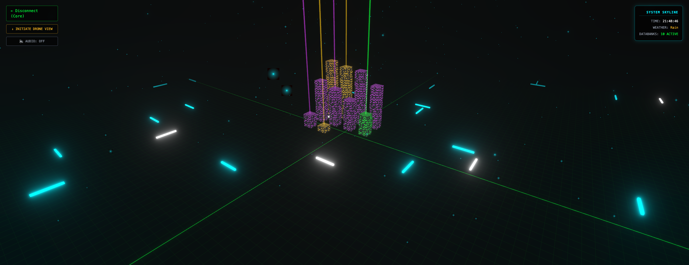

# 🏙️ GitHub City: An Immersive 3D Portfolio

Welcome to **GitHub City**, a real-time, interactive 3D visualization of my GitHub repositories. Built with **React**, **Three.js**, and **Tailwind CSS**, this project transforms data into a living, breathing cyberpunk metropolis.


---

## 🌟 Key Features

### 🏗️ Dynamic Skyline
Every building represents a repository. The **height** is determined by the project size, and the **color** reflects the primary programming language used.

### 🛸 Drone & Street View
Switch between a tactical bird's-eye view and an immersive **Drone Mode**. Use `W`, `A`, `S`, `D` to fly through the skyscrapers and explore the grid.

### ⛈️ Real-time Environment
- **Weather Sync:** Fetches real-world weather data based on your location (Rain, Snow, or Clear).
- **Day/Night Cycle:** Automatically adjusts lighting and atmosphere based on your local time.

### 📊 Interactive Data Banks
Hover over any building to reveal a sleek HUD displaying:
- Repository Name
- Detailed Language Breakdown (via GitHub API)
- Direct Access Links

### 🔒 The "Suhan" Protocol
Hidden deep within the code lies a secret. Try typing the developer's name while in the city to trigger a **Top Secret** event and unlock the "Secret Tower."

---

## 🛠️ Tech Stack

- **Frontend:** React 18 (Vite)
- **3D Engine:** Three.js / @react-three/fiber
- **Helper Libraries:** @react-three/drei (Controls, Shaders)
- **Styling:** Tailwind CSS v4 + PostCSS
- **Data Source:** GitHub REST API
- **Weather:** Open-Meteo API

---

## 🚀 Getting Started

1. **Clone the repository:**
   ```bash
   git clone [https://github.com/SuhanArda/github-city.git](https://github.com/SuhanArda/github-city.git)
   cd github-city

2. Install dependencies:
   ```bash
   npm install
   
3. Run the development server:
   ```bash
   npm run dev
   
4. Build for production:
   ```bash
   npm run build
   
🎮 Controls
<<<<<<< HEAD
ActionControlRotate CameraLeft Click + Drag (Orbit Mode)Move Drone W A S D (Drone Mode)InteractHover / Click on BuildingsTrigger Easter EggType suhan on your keyboard
=======
ActionControlRotate CameraLeft Click + Drag (Orbit Mode)Move Drone W A S D (Drone Mode)InteractHover / Click on BuildingsTrigger Easter EggType suhan on your keyboard
>>>>>>> ed06e2a758b82093ffbf16fddd038b4606a30101
